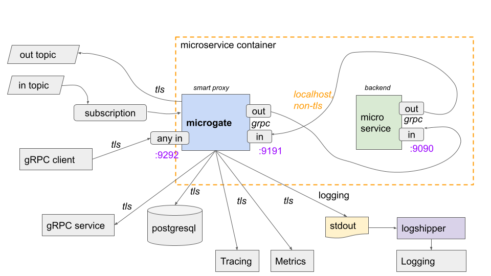

# microgate

This repository provides the Go package for implementing cloud-specific runtimes that offer the microgate-api. It also includes a command `microgate` that can be used for local development of a backend service that leverages the microgate proxy.

## draft design

## example service implementation

See https://github.com/microgate-io/microgate-demo/tree/main/todo/server

### Motivation

This design and implementation was created to address the complexity when creating microservices in a polygot development organisation with increasing demands on standardization of non-functional requirements such as logging, metrics, resilience, error handling, etc.

Compare to the [Dapr initiative](https://dapr.io/), this implementation is gRPC based and requires a per-cloud provider implementation to keep it simple.

2021. MIT License ernestmicklei.com